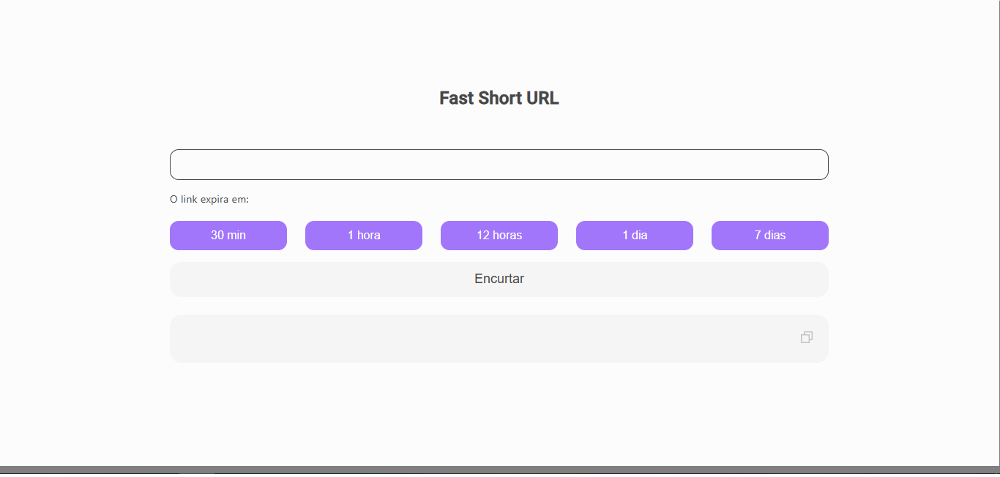
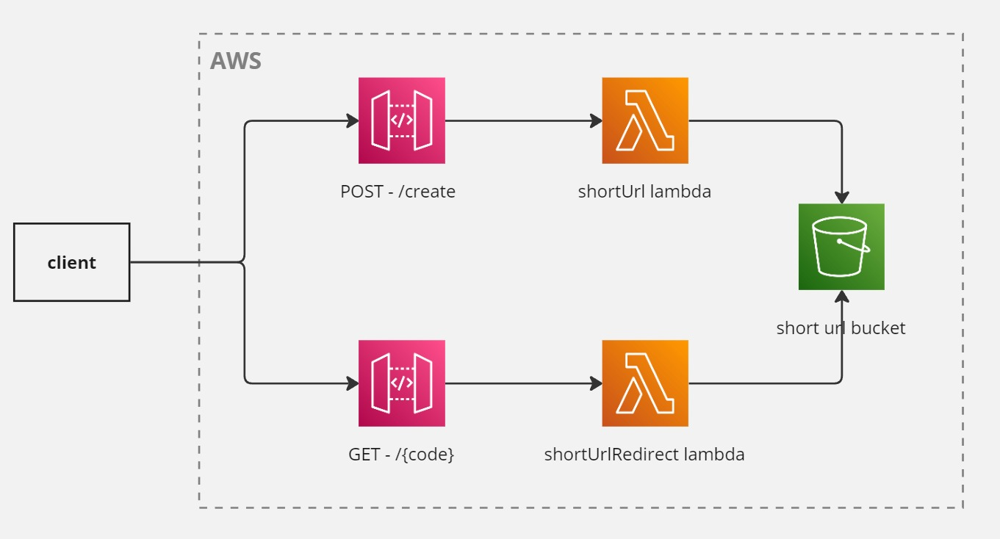

# Angular Client for Short URL Service

This is the client application built using Angular that interacts with the AWS Lambda service for creating short URLs and redirecting to the original URL.

## Features 🚀

- **Create Short URL**: Send a request to create a short URL for any given original URL.
- **URL Redirection**: Access the short URL, and get automatically redirected to the original URL.

## **Diagram of the Flow** 📊

## **Deploy** 🛠️

1. Delete /dist dir
2. Run `ng build --output-path=dist/short-url-client --configuration=production`
3. Copy files generated inside /dist/short-url-client/browser to /dist/short-url-client/
4. Run `npx angular-cli-ghpages --dir=dist/short-url-client`
